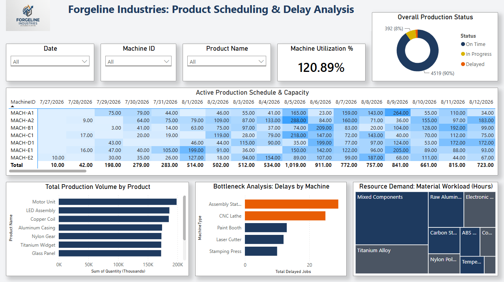
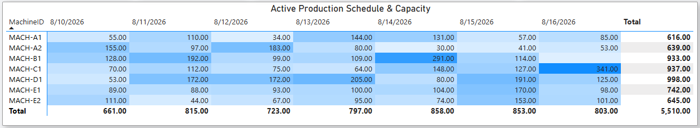

# Forgeline Industries: Production Scheduling & Delay Analysis

## Executive Summary
Forgeline Industries currently lacks real time visibility into the root causes of operational bottlenecks across its manufacturing floor. This project implements an automated, end-to-end pipeline and business intelligence dashboard to identify physical manufacturing delays and track machine utilization. By transitioning from scattered monthly batch files to a centralized command center, operations managers can now proactively monitor capacity limits, prevent scheduling cascades, and maintain customer delivery timelines.

## Methodology & Tech Stacks
* **Data Generation (Python):** Simulated 5,000 synthetic , intentionally messy manufacturing orders using the `pandas` library, utilizing a locked random seed (42) to ensure strict reproducibility.
* **Automated ETL Pipeline (Excel / Power Query):** Established a "drop and refresh" folder connection to automatically append monthly CSV/Excel batch files. Engineered transformation steps to standardize mixed date formats, unify text casing, trim hidden whitespaces from Machine IDs, and impute missing quantities.
* **Data Modeling (Power BI):** Constructed a Star Schema featuring a dynamic `CALENDERAUTO()` Date table to properly handle time intelligence filtering.
* **Advanced DAX Logic:** Deployed robust measures using variables `(VAR)`, `MAX`, and `LOOKUPVALUE` to bypass inactive relationships and handle duplicate Order IDs without breaking the visualizations.

## Key Metrics Tracked
| **Matric** | **Business Value** |
| :--- | :--- |
| **Machine Utilization %** | Identified whether machines are sitting idle or are critically overworked by dividing Scheduled Hours by Active Daily Capacity. |
| **Production Status** | Dynamically classifies every order 'On Time', 'Delayed', 'In Progress' |
| **Material Workload (Hours)** | Translates raw order quantities into actual production hours required per material to aid supply chain purchasing. |
| **Total Delayed Jobs** | Provides an aggregate count of missed deadline across the manufacturing floor. |

## Executive Dashboard



* **Forgeline Navy (#1E3A5F):** Used for primary, positive data points.
* **Steel Gray (#4B5563):** Used for secondary categories and neutral labels.
* **Forge Orange (#E85D04):** Reserved exclusively as an "alert" color to draw attention to delayed jobs and bottlenecks.

## Dashboard Features and Key Business Insights
* **Machine Scheduling Heatmap (Matrix):** Visually exposed overbooked equipment by using conditional formatting to highlight days where scheduled hours exceed physical machine capacity. The heatmap can also be tranformed to a 7-day schedule with the date slicer for a less congested matrix.
* **Bottleneck Analysis (Cluster Bar Chart):** Breaks down Total Delayed Jobs by specific Machine Types, instantly showing if specific equipment (e.g. CNC Lathes) is causing cascading delays.
* **Resource Demand (Tree Map):** Highlights the Material Workload Hours, demonstrating which raw materials are consuming the majority of total machine time.
* **Interactive Global Slicers:** Allows floor managers to slice the data instantly by Date, Machine type, or Product Name.


> Machine Scheduling Heatmap positioned to 7-day schedule for less congested view.

## Strategic Recommendations
* **Optimize Machine Load:** Re-assign upcoming jobs from heavily overbooked machines (highlighted in the matrix Heatmap) to machines currently sitting idle.
* **Proactive Overtime:** Authorize targeted weekend overtime shifts for specific machine operators when scheduled hours vastly exceed the active daily capacity to prevent missed customer deadlines.
* **Customer Communication:** Contact customers regarding orders flagged in the 'Delayed' status before the missed deadline occurs.

## Repository Structure
```text
Forgeline-Production-Scheduling/
|
├── Messy_Manufacturing_Data/
|    ├── Order_Data/                                                # Folder of Orders datasets by month
|    ├── Master_Machines.xlsx                                       # Machine dataset
|    ├── Master_Products.xlsx                                       # Products dataset
|    └── Production_Schedule.xlsx                                   # Production Schedule dataset
├── assets/
|    ├── 7-day_schedule_screenshot.png                              # Schedule heatmap screenshot
|    ├── forgeline_industries.png                                   # Company Logo
|    └── product_scheduling__data_analysis_dashboard.png            # Production Scheduling & Delay Analysis screenshot
├── data_model_excel/
|    └── Manufacturing_Data_Model.xlsx                              # Master Excel workbook with Power Query ETL and original Power Pivot Star Schema
├── power_bi/
|    ├── Production_Scheduling__Delay_Analysis.Report/              # PBIP Report definition
|    ├── Production_Scheduling__Delay_Analysis.SemanticModel/       # PBIP Data model
|    ├── Production_Scheduling__Delay_Analysis.pbip                 # Power BI Project file
|    └── Production_Scheduling__Delay_Analysis.pbix                 # Standard Power BI file
├── py_scripts/
|    ├── data_generation.ipynb                                      # Jupyter Notebook for data generation
|    └── data_generation.py                                         # Executable Python script
├── Bussiness_Requirments.md                                        # Business Problem and Requirements for analysis
└── README.md
```
# Future Enhancements
* **Live ERP Integration:** Integrate a live REST API with Python to replace the synthetic manufacturing order generation.
* **Predictive Maintenance Forecast:** Implement a predictive Machine Learning model with Pythion to forecast the probability of machine downtime based on Scheduled Hours and Active Daily Capacity.
* **Operator Shift Drilldown:** Further analyze machine operator shifts to observe correlations to delayed production statuses.
* **Material Supply Chain Exploration:** Study vendor lead times and material costs for key components like Titanium Alloy and Carbon Steel to determine optimal purchasing schedules.
